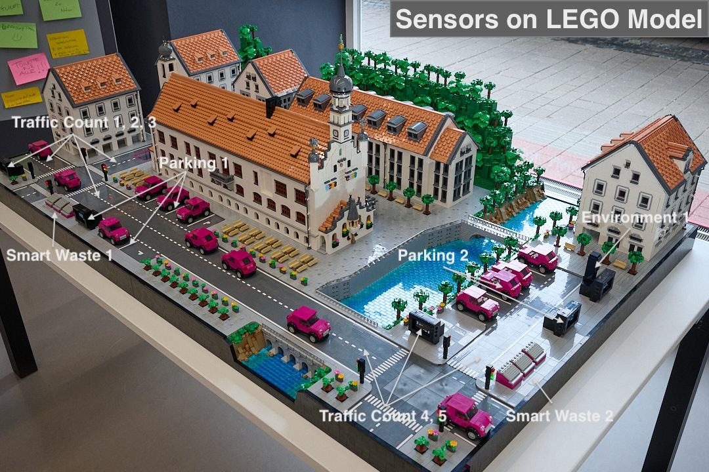

## Project Overview

This repository contains the firmware for a Smart City LEGO model of Kempten (Allgäu), Germany. The model is exhibited at the Zukunftslabor in Kempten to demonstrate how sensor technology works in a smart city context.

The model is equipped with various real sensors and actuators embedded throughout the LEGO structure, creating a functional digital twin of the city. **Parking spaces** are monitored using time-of-flight distance sensors (VL53L0X) that detect whether a vehicle is present by measuring the distance to the ground. **Smart waste containers** use light sensors (GY302/BH1750) combined with LED light barriers to detect fill levels - when waste blocks the light, the sensor registers the container status. **Traffic counting** at intersections is accomplished using magnetic hall effect sensors (KY-024) that detect vehicles passing over them, similar to induction loops in real streets. **Traffic lights** at multiple intersections are fully functional, with tiny SMD LEDs (red, yellow, and green) mounted behind transparent colored LEGO plates, running realistic traffic light sequences controlled by the microcontrollers. An **environmental monitoring station** uses a BME280 sensor to measure temperature, humidity, and air pressure, plus an additional light sensor for ambient light levels. All of this data is displayed on small OLED screens integrated into the model and transmitted via WiFi to an MQTT broker for real-time monitoring.

The system runs on three Raspberry Pico W/2W microcontrollers (small, low-cost boards running MicroPython), with each controller managing a different section of the city: one handles the town hall area with parking and waste management, another controls the traffic lights and counts vehicles at the main intersection, and the third manages the Iller riverside area with parking, waste, traffic, and environmental sensors. All sensors communicate with the microcontrollers via the I2C protocol, using multiplexer chips to connect multiple sensors to the limited number of available pins.

**Target Platform**: MicroPython on Raspberry Pico W and Pico 2 W  
**Language**: Python (MicroPython variant)

