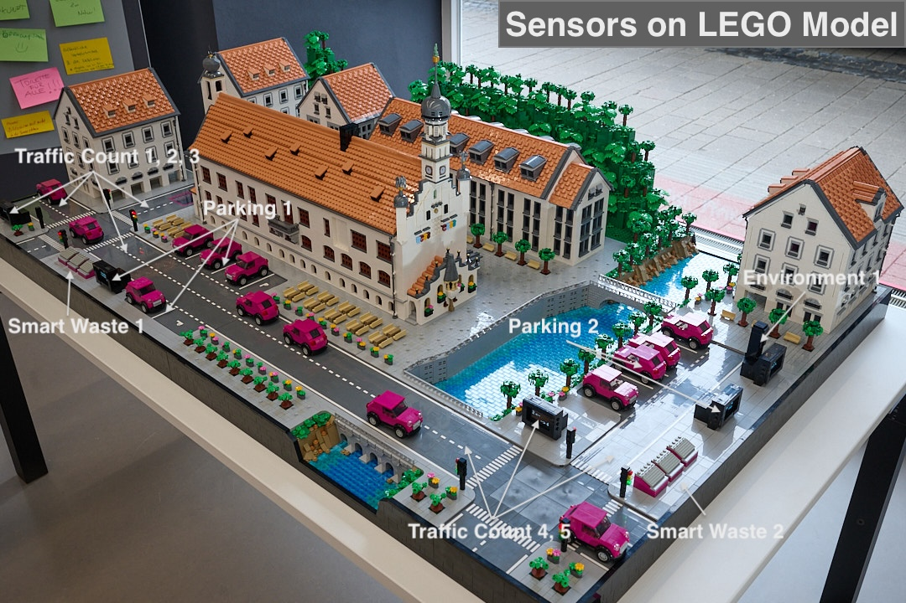

# smart.city.kempten

## german
[english version below](#english)

Dieses Repository enthält den Sourcecode für die Mikrocontroller, Sensoren und weitere Bauteile, die einen
Digitalen Zwilling der [Smart City Kempten (Allgäu)](https://smartes.kempten.de/) in Form eines LEGO® Modells.

Das Modell ist im Zukunftslabor in Kempten ausgestellt und dient dort der Veranschaulichung der Sensorik im Rahmen
des Smart City Projektes, siehe Bild unten.

Das LEGO Modell wurde entworfen und gebaut vom Brick Artist Marius Herrmann (https://steponabrick.com,
info@steponabrick.com), die Elektronik und die Software in diesem Repository wurden von mir
(Thomas Herrmann, mail@thoherr.de) konzipiert und programmiert.

Der grundlegende Aufbau der Software ist im Dokument [docs/SOFTWARE](docs/SOFTWARE.md) beschrieben.
Im Verzeichnis [docs](docs) sind auch (vereinfachte) Verdrahtungspläne für die drei Mikrocontroller zu finden.

*Hinweis: Die weitere Dokumentation ist in Englisch,
um die im Sourcecode verwendeten Begriffe nahtlos verwenden zu können.*

## english

This repository contains the source code for a couple of microcontrollers,
sensors and other ICs implementing a digital twin of the [Smart City Kempten (Allgäu)](https://smartes.kempten.de/)
as a LEGO® model.

The model ist at exhibition at the "Zukunftslabor" in Kempten to visualize sensor technoligy, see picture above.

The model was built by Brick Artist Marius Herrmann (https://steponabrick.com,
info@steponabrick.com), the electronics and software was implemented by me
(Thomas Herrmann, mail@thoherr.de).

The basic design of the software and it's configuration is documented in [docs/SOFTWARE](docs/SOFTWARE.md).
The directory [docs](docs) also contains (simplified) wiring plans of the three microcontrollers.
